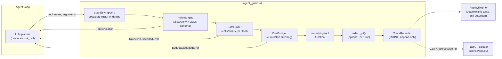

# agent-guardrail

Policy enforcement, cost budgeting, tracing and deterministic replay for LLM
agent tool calls -- a thin, dependency-light middleware layer you drop
between an agent's planning loop and the tools it's allowed to invoke.

## Problem statement

Agentic AI systems delegate real actions -- web search, file access, email,
shell commands, paid APIs -- to code chosen and parameterized by an LLM.
That's exactly what makes them useful, and exactly what makes them risky:

* **No enforcement boundary.** Most agent frameworks let any tool run with
  whatever arguments the model produced. A prompt-injected or simply
  confused agent can call `send_email` or `execute_shell` with no guardrail
  in between.
* **No cost ceiling.** A runaway loop (an agent stuck retrying a failing
  tool) can burn an unbounded amount of paid API spend before anyone
  notices.
* **No observability.** When an agent misbehaves in production, teams often
  cannot answer "what tools did it call, with what arguments, in what
  order, and why did it decide to call them?"
* **No regression safety net.** Agent behavior is non-deterministic by
  nature (the LLM's output varies), which makes it hard to write a
  classic unit test for "did the agent do the right thing this time."

`agent-guardrail` addresses all four with a small, composable Python
library plus an optional language-agnostic REST sidecar:

* a **policy engine** (YAML-defined allow/deny + JSON-schema argument
  validation),
* a **budget & rate limiter** (per-session cost ceiling, per-tool
  calls/minute),
* a **PII-redacting trace recorder** (durable JSONL log of every call), and
* a **replay engine** that turns a recorded trace into a deterministic
  regression test or a mock tool set.

## Architecture overview



Two ways to integrate:

1. **In-process (Python agents):** wrap each tool function with the
   `@guard(policy=..., tracer=..., budget=...)` decorator. Zero network
   hop, sub-millisecond overhead.
2. **Sidecar (any language/framework):** run `agent_guardrail.service.app`
   as a small FastAPI service and call `POST /evaluate` before executing a
   tool, then `POST /record` afterwards. Useful for Node/Go/Java agent
   stacks, or for centralizing policy across many agent processes.

## Project layout

```
agent_guardrail/
  policy.py       PolicyRule / Policy / PolicyEngine (YAML-driven)
  budget.py       CostBudget, RateLimiter
  redact.py       regex-based PII redaction
  tracing.py      TraceEvent / TraceRecorder (JSONL)
  guard.py        the guard() decorator tying it all together
  replay.py       ReplayEngine for deterministic replay / drift detection
  cli.py          `agent-guardrail` command-line tool
  service/
    app.py        FastAPI sidecar (/health, /evaluate, /record, /trace)
    models.py      pydantic request/response schemas
policies/
  example_policy.yaml
examples/
  basic_usage.py
  openai_function_calling_example.py
tests/            pytest suite covering every module above
```

## Setup

Requires Python 3.10+.

```bash
python -m venv .venv
source .venv/bin/activate
pip install -r requirements-dev.txt
```

## Usage

### As a decorator (in-process)

```python
from agent_guardrail import Policy, TraceRecorder, CostBudget, guard

policy = Policy.from_yaml("policies/example_policy.yaml")
tracer = TraceRecorder("traces/session.jsonl", session_id="demo")
budget = CostBudget(max_total_cost=1.00)

@guard(policy=policy, tracer=tracer, budget=budget)
def search_web(query: str) -> str:
    ...  # your real tool implementation

search_web(query="agentic AI orchestration")
```

A call that violates policy (unknown tool, bad arguments, rate limit, or
budget) raises before your tool body ever executes, and is still recorded
in the trace with `decision="denied"`.

### As a CLI

```bash
agent-guardrail check-policy policies/example_policy.yaml \
    --tool search_web --args '{"query": "hello"}'

agent-guardrail show-trace traces/session.jsonl

agent-guardrail replay traces/session.jsonl
```

### As a sidecar service

```bash
uvicorn agent_guardrail.service.app:app --reload --port 8080
curl -X POST localhost:8080/evaluate \
    -H 'content-type: application/json' \
    -d '{"tool_name": "search_web", "arguments": {"query": "hi"}}'
```

### Replay for regression testing

```python
from agent_guardrail import ReplayEngine

replay = ReplayEngine("traces/session.jsonl")
output = replay.next_output("search_web", {"query": "hello"})
# assert an agent's new run calls exactly the tools/args it did last time:
replay.assert_matches([{"tool_name": "search_web", "arguments": {"query": "hello"}}])
```

See `examples/basic_usage.py` and
`examples/openai_function_calling_example.py` for complete, runnable
walkthroughs (the latter simulates an OpenAI-style `tool_calls` payload so
it runs fully offline).

## Running tests

```bash
pytest --cov=agent_guardrail --cov-report=term-missing
ruff check .
```

## Docker

```bash
docker build -t agent-guardrail .
docker run --rm -p 8080:8080 agent-guardrail
curl localhost:8080/health
```

## Limitations

* The PII redaction in `redact.py` is a set of high-precision regexes for
  common shapes (email, phone, SSN, credit-card, IPv4). It is a pragmatic
  defense-in-depth layer, not a substitute for a dedicated DLP/PII
  detection service in a regulated production environment.
* `TraceRecorder` writes an append-only JSONL file; it is not a
  replacement for a real observability backend (OpenTelemetry, a hosted
  tracing store, etc.) at high call volumes -- treat it as the audit-log
  primitive to export from, not the final destination.
* The sidecar's `RateLimiter` and `CostBudget` are in-memory and
  per-process; running multiple sidecar replicas behind a load balancer
  requires a shared backing store (e.g. Redis) for correct cross-replica
  enforcement, which is out of scope for this reference implementation.
* `guard()` estimates cost either from a fixed `max_cost_per_call` in
  policy or a caller-supplied `cost_fn`; it has no built-in integration
  with a specific LLM provider's token-usage metering.

## License

MIT -- see `LICENSE`.
