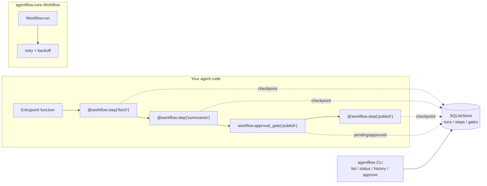

# agentflow-runtime

A lightweight **durable execution runtime for multi-step LLM agent
workflows** — think "Temporal, but small enough to read in an afternoon" for
agentic pipelines. It gives every step of an agent workflow automatic
checkpointing, crash-safe resume, retry-with-backoff, and human-in-the-loop
approval gates, all backed by a single SQLite file and a plain Python
decorator API.

## Problem statement

Agentic systems chain together expensive, unreliable operations: LLM calls,
tool invocations, web/API requests, and (increasingly) points where a human
needs to review or approve before the agent proceeds. Naive agent scripts
re-run the *entire* pipeline from scratch on any failure — which means
re-paying for LLM calls that already succeeded, re-hitting rate-limited
APIs, and losing any progress made before a crash or a required human
approval.

`agentflow` solves this with a small, dependency-free durable-execution
core:

- **Checkpointing** — every `@workflow.step(...)`-decorated function's
  result is persisted the moment it succeeds, keyed by `(run_id, step_name)`.
- **Resumability** — re-invoking `workflow.run(entrypoint)` with the same
  `run_id` replays the entrypoint function, but any step that already has a
  completed checkpoint returns its cached result instantly instead of
  re-executing — so a crash, a process restart, or a human approval pause
  never re-runs completed work.
- **Retries with backoff** — steps can declare `max_retries`, and failures
  are retried with exponential backoff + jitter, with each attempt
  persisted for observability.
- **Human-in-the-loop gates** — `workflow.approval_gate("name")` pauses the
  whole run (persisted as `waiting`) until an operator approves it, e.g. via
  the bundled `agentflow approve <run_id> <gate>` CLI command.
- **Zero infrastructure** — the default store is a single SQLite file. No
  broker, no external service, easy to embed in an existing agent process
  or CI job.

## Architecture



Step lifecycle for a single `@workflow.step`:

```
        ┌────────────┐   already completed?   ┌───────────────┐
 call ->│ check store│───────── yes ──────────>│ return cached │
        └─────┬──────┘                         │    result     │
              │ no                             └───────────────┘
              v
        ┌────────────┐   success   ┌────────────────────┐
        │  run fn()  │────────────>│ persist "completed" │
        └─────┬──────┘             └────────────────────┘
              │ raises (retry_on)
              v
        ┌──────────────────────┐   attempts < max_retries
        │ persist "failed",    │──────────────┐
        │ sleep(backoff+jitter)│              │
        └──────────────────────┘              v
              │                          retry run fn()
              │ attempts exhausted
              v
        ┌────────────┐
        │ StepFailed │ -> propagates as WorkflowFailed
        └────────────┘
```

## Project layout

```
agentflow/
  core.py        Workflow, @step decorator, approval_gate, run orchestration
  store.py        Store interface + SQLiteStore (runs / steps / gates tables)
  retry.py        exponential backoff + jitter helper
  exceptions.py   ApprovalPending, StepFailed, WorkflowFailed
  cli.py          `agentflow` CLI: list / status / history / approve
examples/
  research_agent_workflow.py   end-to-end demo with a flaky step + approval gate
tests/
  test_core.py, test_store.py, test_retry.py, test_cli.py
```

## Setup

Requires Python 3.10+.

```bash
python -m venv .venv && source .venv/bin/activate
pip install -e ".[dev]"
```

## Usage

```python
from agentflow import SQLiteStore, Workflow, ApprovalPending

store = Workflow  # (see below for a full example)
store = SQLiteStore("agentflow.db")
workflow = Workflow(name="research_agent", run_id="run-42", store=store)

@workflow.step("fetch_sources", max_retries=3, backoff_base=0.5)
def fetch_sources(ctx):
    return call_flaky_search_api()

@workflow.step("summarize")
def summarize(ctx, sources):
    return call_llm_to_summarize(sources)

def entrypoint(wf):
    sources = fetch_sources(wf)
    summary = summarize(wf, sources)
    wf.approval_gate("publish_approval")   # pauses here until approved
    return {"summary": summary}

result = workflow.run(entrypoint)
```

If the process crashes after `fetch_sources` succeeds, or the workflow pauses
at `approval_gate`, simply re-run the same code with the same `run_id`:
`fetch_sources` (and `summarize`, once it has run) will return their cached
results instantly instead of re-executing.

Run the bundled example:

```bash
python examples/research_agent_workflow.py run-demo-1
# -> paused: run 'run-demo-1' waiting for approval at gate 'publish_approval'.

agentflow --db examples.db approve run-demo-1 publish_approval

python examples/research_agent_workflow.py run-demo-1
# -> workflow completed: {'published': True, 'summary': '...'}
```

### CLI

```bash
agentflow --db agentflow.db list
agentflow --db agentflow.db status <run_id>
agentflow --db agentflow.db history <run_id>
agentflow --db agentflow.db approve <run_id> <gate_name> --note "reviewed by X"
```

## Testing

```bash
pytest -q
ruff check .
mypy agentflow
```

## Docker

```bash
docker build -t agentflow-runtime .
docker run --rm -v "$(pwd)/data:/data" agentflow-runtime --db /data/agentflow.db list
```

The image runs the full test suite during `docker build`, so a broken build
fails fast.

## Limitations

- Step results/arguments must be JSON-serializable (the store persists them
  as JSON); large binary payloads should be stored externally and referenced
  by ID/URL instead.
- `SQLiteStore` is designed for single-process (optionally multi-threaded)
  use. For distributed workers sharing one store, swap in a backend that
  implements `agentflow.store.Store` on top of Postgres/Redis/etc.
- Steps must be idempotent-safe to *skip* (not necessarily idempotent to
  re-run): once a step is marked `completed`, its body will not run again
  for that `run_id`, even if its declared arguments would differ on replay.
  Keep step inputs derived from prior step outputs (as in the example) so
  replays are deterministic.
- There is no built-in scheduler/queue for concurrently executing many
  workflow runs — `agentflow` focuses on making a single run's execution
  durable; running many runs concurrently is left to your process/orchestration
  layer (e.g. a task queue that calls `workflow.run(...)` per job).
