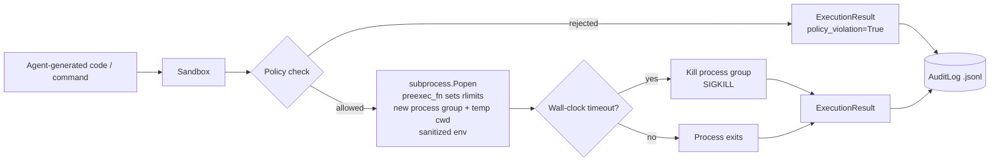

# agent-code-sandbox

[](https://github.com/manyu-lnmiit/agent-code-sandbox/actions/workflows/ci.yml)
[](LICENSE)


A secure, dependency-light sandboxed execution engine for running LLM/agent-generated Python and shell snippets safely. It's the piece of infrastructure a "code interpreter" tool, autonomous coding agent, or data-analysis agent needs between "the model wrote some code" and "that code actually ran" — enforcing CPU/memory/time/filesystem/network limits with nothing but the Python standard library at its core, plus an optional FastAPI HTTP layer.

## Install + hello world

```bash
pip install agent-code-sandbox
```

```python
from agent_code_sandbox import Sandbox

sandbox = Sandbox()  # sane defaults: 5 CPU-seconds, 256MB, 10s wall clock
from agent_code_sandbox.executors.python_executor import run_python

result = run_python(sandbox, "print('hello from the sandbox')")
print(result.stdout, result.success)
```

## Problem statement

Agentic systems increasingly let an LLM write and execute code as part of its reasoning loop — a "code interpreter" tool, a data-analysis copilot, an autonomous coding agent that runs the tests it just wrote. That code is untrusted by construction: it might be buggy (infinite loops, runaway memory allocation), or it might be actively adversarial if the agent has been prompt-injected. Running it directly with `subprocess.run` on the host is asking for a stuck CPU core, an OOM'd box, secrets leaking through the environment, or a `curl | sh` reaching out to the internet.

`agent-code-sandbox` gives you a small, auditable layer that:

- Bounds CPU time, memory, and file size via POSIX rlimits, and bounds wall-clock time from the parent process.
- Sanitizes the subprocess environment so parent-process secrets aren't inherited by default.
- Runs code in an isolated temporary working directory.
- Allowlists shell commands and rejects shell metacharacters that would allow chaining/substitution.
- Records every execution attempt — successful, failed, or blocked — to a tamper-evident JSONL audit log.
- Offers best-effort network isolation via `unshare -n` when available.

It deliberately does **not** try to be a container runtime. See [Limitations / Security Model](#limitations--security-model) below for the honest boundary.

## Architecture overview



Package layout:

```
src/agent_code_sandbox/
  core/
    limits.py     # ResourceLimits dataclass + apply_rlimits() (preexec_fn body)
    policy.py     # SandboxPolicy: env allowlist, shell allowlist, operator rejection
    result.py     # ExecutionResult dataclass
    sandbox.py    # Sandbox: spawns + supervises the subprocess, timeout kill, unshare
  executors/
    python_executor.py   # writes code to a temp .py file, runs it under Sandbox
    shell_executor.py    # policy-checks + shlex.split's a command, runs it under Sandbox
  audit.py        # AuditLog: JSONL writer/reader/query API
  cli.py          # argparse-based CLI, console-script entry point
  api.py          # optional FastAPI app (requires the `api` extra)
```

## Usage

### CLI

```bash
agent-code-sandbox run-python "print(1 + 1)"
agent-code-sandbox run-python --file snippet.py --timeout 5 --memory-mb 128 --cpu-seconds 2
agent-code-sandbox run-shell "echo hello"
agent-code-sandbox run-shell "rm -rf /"     # rejected: not on the allowlist
agent-code-sandbox audit --last 10 --only failure
```

### Python API

```python
from agent_code_sandbox import Sandbox, SandboxPolicy, ResourceLimits
from agent_code_sandbox.executors.python_executor import run_python
from agent_code_sandbox.executors.shell_executor import run_shell
from agent_code_sandbox.audit import AuditLog

policy = SandboxPolicy(allow_network=False)
limits = ResourceLimits(cpu_seconds=5, memory_mb=256, wall_timeout_seconds=10)
sandbox = Sandbox(policy=policy, limits=limits)

result = run_python(sandbox, "import math\nprint(math.factorial(10))")
print(result.stdout, result.exit_code, result.success)

blocked = run_shell(sandbox, "curl http://example.com")
print(blocked.policy_violation)  # True -- never spawned a process

AuditLog().record("python", "import math...", limits, result)
for entry in AuditLog().last(5):
    print(entry.kind, entry.payload_sha256[:12], entry.result["success"])
```

### Optional HTTP API

```bash
pip install "agent-code-sandbox[api]"
uvicorn agent_code_sandbox.api:app --reload
```

```bash
curl -X POST http://localhost:8000/execute/python \
  -H 'Content-Type: application/json' \
  -d '{"code": "print(2 + 2)", "timeout": 5, "memory_mb": 128, "cpu_seconds": 2}'

curl -X POST http://localhost:8000/execute/shell \
  -H 'Content-Type: application/json' \
  -d '{"command": "echo hi", "timeout": 5, "memory_mb": 128, "cpu_seconds": 2}'

curl 'http://localhost:8000/audit?last=10&only=failure'
```

### Configuration via environment variable

| Variable | Purpose | Default |
|---|---|---|
| `AGENT_SANDBOX_AUDIT_LOG_PATH` | Path to the JSONL audit log | `~/.agent_code_sandbox/audit.jsonl` |

See `.env.example`.

## Limitations / Security Model

**Be clear-eyed about what this is and isn't.**

This project mitigates the *accidental* and *resource-exhaustion* failure modes of running agent-generated code: infinite loops, runaway memory allocation, huge file writes, secrets leaking via the environment, and (best-effort) unwanted network egress. It does this with:

- POSIX rlimits (`RLIMIT_CPU`, `RLIMIT_AS`, `RLIMIT_FSIZE`, `RLIMIT_NPROC`) applied via `preexec_fn`.
- A parent-enforced wall-clock timeout that kills the entire process group.
- A sanitized, allowlisted environment (the subprocess does **not** inherit the full parent `os.environ`).
- An isolated temporary working directory per execution.
- Shell command allowlisting and shell-operator rejection for `run_shell`.

**What it is *not*:**

- **Not a container or VM boundary.** There is no filesystem chroot/pivot_root, no cgroup, no seccomp-bpf syscall filter, and no true process isolation beyond process groups. A sufficiently creative payload with access to `python3` still shares the host kernel and (aside from rlimits) the host filesystem namespace.
- **Network isolation is best-effort.** If the `unshare` binary is present *and* the environment allows creating a new network namespace (requires `CAP_SYS_ADMIN` or working unprivileged user namespaces), `allow_network=False` prepends `unshare -n --` to the subprocess command, giving it no network devices at all. If `unshare` is missing, or present but unprivileged (common inside containers/CI), execution falls back automatically to clearing proxy-related environment variables (`http_proxy`, `https_proxy`, etc.) only — this does **not** prevent a process from opening raw sockets to the internet. The `ExecutionResult.network_isolation` field tells you which mode was actually used (`"unshare"` vs `"best-effort-env-only"` vs `"disabled"`), and it's recorded in the audit log so you can tell after the fact whether real isolation was in effect.
- **Not a memory-safety boundary.** `RLIMIT_AS` bounds address space, not necessarily every way a process can hurt the host (e.g. it doesn't prevent CPU cache-timing shenanigans or exhausting shared kernel resources not covered by rlimits).
- **No mandatory access control on the filesystem.** `SandboxPolicy.extra_read_paths` / `extra_write_paths` are currently advisory/documentation fields for callers building their own layer on top; this package does not itself enforce a filesystem allowlist via chroot, bind mounts, or Landlock.

**If you need a hard security boundary** (e.g. running fully untrusted, potentially malicious code from third parties), put this sandbox *inside* something with real isolation — a container with dropped capabilities and a seccomp profile, gVisor, Firecracker microVMs, or a dedicated worker VM — and treat `agent-code-sandbox` as the resource-governance layer on top, not the whole story.

## Development

```bash
pip install -e ".[api]" -r requirements.txt
pytest --cov=agent_code_sandbox
ruff check .
```

## License

MIT — see [LICENSE](LICENSE).
