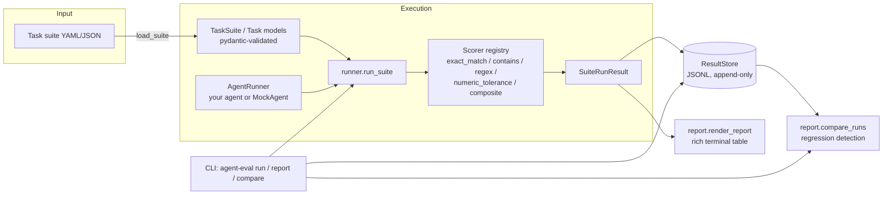

# agent-eval-harness

A lightweight, dependency-light framework for **evaluating and regression-testing LLM
agents** against declarative task suites — the missing "pytest for agents."

## Problem statement

Teams building LLM agents (single-agent tools, multi-step planners, RAG pipelines) ship
changes constantly: a new system prompt, a swapped model, an updated tool schema. Almost
none of these teams have an automated way to answer "did this change make the agent worse
at the things it needs to do?" Manual spot-checking doesn't scale, and full-blown eval
platforms are often heavyweight, cloud-only, or tied to a specific model provider.

`agent-eval-harness` fills that gap with a small, self-hostable library and CLI that lets
you:

- Define **tasks** (prompt + expected behavior) in plain YAML/JSON — no code required for
  the common cases.
- Score outputs with **pluggable scorers**: exact match, substring/keyword containment,
  regex, numeric tolerance, or any weighted composite of these — plus a simple interface
  for plugging in your own (e.g. an LLM-as-judge scorer).
- Run any agent that exposes a one-method `run(prompt) -> output` interface — wrap your
  existing agent, no framework lock-in.
- Persist every run to an append-only JSONL store and **diff two runs** to catch
  regressions (tasks that used to pass and now fail) before they reach production.
- Wire it into CI via the included GitHub Actions workflow so a pull request that
  regresses agent behavior fails the build.

## Architecture overview



**Module layout:**

```
agent_eval_harness/
├── task.py       # Task / TaskSuite pydantic models + YAML/JSON loader
├── scorers.py    # Scorer ABC + built-ins (ExactMatch, Contains, RegexMatch,
│                 #   NumericTolerance, Composite) + a name -> class registry
├── runner.py     # AgentRunner protocol, run_task/run_suite execution engine
├── storage.py    # ResultStore: append-only JSONL persistence of past runs
├── report.py     # rich table rendering + compare_runs regression diffing
├── mock_agent.py # MockAgent: deterministic stand-in agent for tests/demos
└── cli.py        # `agent-eval` command group (run / report / compare)
```

The design keeps each concern independently testable and swappable: you can use just the
`scorers` module in your own test suite, or just `storage`/`report` to build regression
dashboards on top of results produced elsewhere.

## Setup

Requires Python 3.10+.

```bash
git clone <this-repo-url>
cd agent-eval-harness
pip install -e ".[dev]"
```

## Usage

### 1. Define a task suite

```yaml
# examples/tasks.yaml
name: quickstart-suite
description: A minimal example suite demonstrating each built-in scorer type.
tasks:
  - id: greeting-exact
    prompt: "Say hello"
    scorer: exact_match
    expected: "Say hello"

  - id: numeric-approx
    prompt: "42"
    scorer: numeric_tolerance
    expected: 42
    scorer_kwargs: { abs_tol: 0.5 }
    weight: 2.0
```

### 2. Wrap your agent

Any object with a `run(prompt: str) -> Any` method works:

```python
# examples/demo_agent.py
class MyAgent:
    def run(self, prompt: str) -> str:
        return call_my_llm(prompt)

def make_agent() -> "MyAgent":
    return MyAgent()
```

### 3. Run the suite

```bash
# Built-in echoing mock agent, useful for smoke-testing the harness itself
agent-eval run --suite examples/tasks.yaml --agent mock --store runs.jsonl

# Your own agent, resolved as module.path:factory_function
agent-eval run --suite examples/tasks.yaml \
  --agent examples.demo_agent:make_agent --store runs.jsonl --fail-under 0.9
```

This prints a pass/fail table with per-task scores and latency, then appends the run to
`runs.jsonl`.

### 4. Catch regressions between runs

```bash
agent-eval compare --store runs.jsonl --fail-on-regression
```

Exits non-zero if any task that passed in the previous stored run now fails — perfect for
a CI gate on top of the included `.github/workflows/ci.yml`.

### 5. Use it as a library

```python
from agent_eval_harness import Task, TaskSuite, MockAgent, run_suite

suite = TaskSuite(
    name="smoke",
    tasks=[Task(id="t1", prompt="2+2", scorer="numeric_tolerance", expected=4)],
)
agent = MockAgent(responses={"2+2": "4"})
result = run_suite(agent, suite)
assert result.pass_rate == 1.0
```

## Extending with custom scorers

```python
from agent_eval_harness.scorers import Scorer, ScoreResult, register_scorer

class LengthUnder(Scorer):
    def __init__(self, max_len: int = 280):
        self.max_len = max_len

    def score(self, output, expected) -> ScoreResult:
        passed = len(str(output)) <= self.max_len
        return ScoreResult(score=1.0 if passed else 0.0, passed=passed)

register_scorer("length_under", LengthUnder)
```

Then reference `scorer: length_under` in a task file.

## Running tests

```bash
pytest --cov=agent_eval_harness
```

## Docker

```bash
docker build -t agent-eval-harness .
docker run --rm agent-eval-harness run --suite examples/tasks.yaml --agent mock
```

## Limitations

- `run_suite` executes tasks sequentially; there is no built-in concurrency for
  high-latency agents (parallelizing `run_task` calls is a natural extension).
- No first-party LLM-as-judge scorer ships out of the box, to keep the dependency
  footprint small — plug one in via `register_scorer` (see above) or `Composite`.
- `ResultStore` is a single append-only JSONL file, which is simple and diff-friendly but
  not intended for concurrent writers or very large histories; swap in a database-backed
  store behind the same interface if you outgrow it.
- Agent timeouts (`Task.timeout_s`) are part of the schema but enforcement is left to the
  `AgentRunner` implementation — the harness does not itself kill a hung call.

## License

MIT — see [LICENSE](LICENSE).
