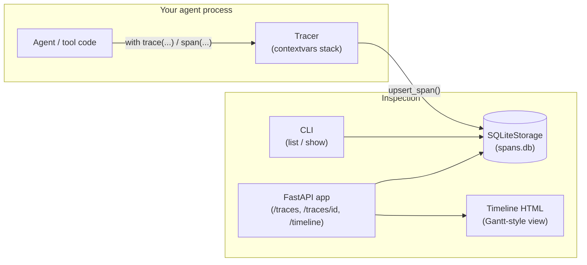

# agent-trace-lens

Lightweight distributed tracing, storage, and timeline visualization for multi-agent LLM systems.

## Problem statement

Multi-agent LLM applications (planner/executor loops, tool-calling agents, multi-step
chains) fail in ways that are hard to see from logs alone: a tool call silently retries
three times, an LLM call inside a sub-agent takes 8 seconds while the parent thinks it
took 200ms, or an error three levels deep in a nested agent call gets swallowed before
it bubbles up. General-purpose APM tools (Jaeger, Datadog APM) are built around HTTP
spans and don't understand the concept of an "agent", a "tool call", or "tokens in/out".

`agent-trace-lens` is a small, dependency-light library you drop into any Python agent
stack (LangChain, custom orchestration loops, raw API calls) to record structured spans
— agent steps, tool calls, LLM calls — with parent/child nesting, timing, status, and
token accounting, store them locally in SQLite, and inspect them either via a CLI table
or a zero-JS-framework HTML timeline (a Gantt-style view) served by a small FastAPI app.

It is intentionally not a hosted SaaS or a heavyweight OpenTelemetry integration: it is
the tool you reach for when you want to see *why* your agent run took 6 seconds and
which of the 14 nested calls the time actually went to, without standing up an
observability platform.

## Architecture overview



Core concepts:

- **Span** — one unit of work: an agent step, a tool call, or an LLM call. Has a kind
  (`agent`, `tool`, `llm`, `chain`, `custom`), start/end time, status (`ok` / `error` /
  `running`), free-form attributes, and optional token counts.
- **Trace** — a tree of spans sharing a `trace_id`, rooted at the outermost span.
- **Tracer** — the instrumentation API (`trace()`, `span()`, `@instrument`) that tracks
  the current trace/span via `contextvars`, so nesting works correctly even across
  `async`/thread boundaries within the same logical call stack.
- **StorageBackend** — a small protocol (`upsert_span`, `get_trace`, `list_traces`, ...)
  implemented today by `SQLiteStorage`; swappable for a future Postgres/Redis backend
  without touching the tracer or API.

## Setup

```bash
python -m venv .venv && source .venv/bin/activate
pip install -e ".[dev]"
cp .env.example .env  # optional: customize the DB path / host / port
```

Requires Python 3.10+.

## Usage

### 1. Instrument your agent code

```python
from agent_trace_lens import trace, span, get_tracer

with trace("customer-support-run"):
    with span("planner", kind="agent"):
        plan = make_plan()

    with span("search_web", kind="tool") as s:
        s.set_attribute("query", "refund policy")
        results = search("refund policy")

    with span("llm_call", kind="llm") as s:
        response = call_llm(results)
        s.set_tokens(tokens_in=response.usage.input, tokens_out=response.usage.output)
```

Or use the decorator form for existing functions:

```python
tracer = get_tracer()

@tracer.instrument(kind="tool")
def fetch_order_status(order_id: str) -> str:
    ...
```

Spans are persisted to `agent_trace_lens.db` (SQLite) as they start and finish — no
buffering step required, so a crashed process still leaves partial traces on disk.

### 2. Inspect traces from the CLI

```bash
agent-trace-lens list                 # recent traces with span count / errors / duration
agent-trace-lens show <trace_id>      # every span in one trace
agent-trace-lens show <trace_id> --json
```

### 3. Browse the timeline in a browser

```bash
agent-trace-lens serve --port 8000
# then open http://localhost:8000/traces/<trace_id>/timeline
```

The timeline view renders each span as a bar positioned and sized by its start time and
duration, indented by nesting depth, and colored by span kind — a minimal, dependency-free
Gantt chart built with inline CSS/JS (no charting library required).

### HTTP API

| Method | Path                          | Description                          |
|--------|-------------------------------|---------------------------------------|
| GET    | `/health`                      | Liveness check                        |
| GET    | `/traces?limit=50`             | List recent traces with aggregates    |
| GET    | `/traces/{trace_id}`           | All spans for a trace                 |
| GET    | `/traces/{trace_id}/timeline`  | HTML Gantt-style timeline view        |
| DELETE | `/traces/{trace_id}`           | Delete a trace and its spans          |

## Running tests

```bash
pytest --cov=agent_trace_lens --cov-report=term-missing
ruff check src tests
```

## Docker

```bash
docker build -t agent-trace-lens .
docker run -p 8000:8000 -v $(pwd)/data:/data agent-trace-lens
```

## Limitations

- Single-node only: `SQLiteStorage` is not safe for multiple processes writing to the
  same file over a network filesystem. For multi-process/multi-host deployments, add a
  new `StorageBackend` implementation (e.g. Postgres) — the tracer and API do not need
  to change.
- No sampling or batching: every span is written to disk synchronously as it starts and
  finishes. Fine for typical agent workloads (dozens to low-thousands of spans per run)
  but not tuned for extremely high-throughput tracing.
- The timeline view is a simple linear Gantt chart, not a full trace-waterfall UI with
  zoom/pan; it favors zero external JS dependencies over feature completeness.
- No built-in auth on the FastAPI app — put it behind your own reverse proxy / auth
  layer before exposing it beyond localhost.

## License

MIT — see [LICENSE](./LICENSE).
