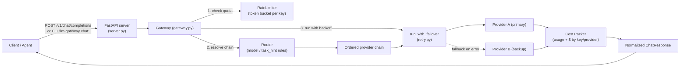

# llm-gateway

[](https://github.com/manyu-lnmiit/llm-gateway/actions/workflows/ci.yml)
[](LICENSE)
[](pyproject.toml)

**llm-gateway** puts one small, dependency-light control plane in front of every LLM
provider your agents and services talk to. It gives you rule-based routing by model or
task, automatic failover to a backup provider when one is degraded, per-caller rate
limiting, and live token/cost accounting — all behind a single OpenAI-compatible
`/v1/chat/completions` endpoint (or a plain Python API), so you stop hand-rolling retry
and fallback logic in every service that calls an LLM.

## Quickstart

```bash
pip install -e .
llm-gateway chat "Summarize the plot of Dune in one sentence." --model mock-small
```

```json
{
  "id": "chatcmpl-3f9a1c2b0d4e",
  "object": "chat.completion",
  "model": "mock-small",
  "provider": "primary",
  "choices": [
    { "index": 0, "message": { "role": "assistant", "content": "[primary:mock-small] ..." } }
  ],
  "usage": { "prompt_tokens": 11, "completion_tokens": 9, "total_tokens": 20, "cost_usd": 0.000019 },
  "gateway": { "latency_ms": 0.04, "attempts": 1 }
}
```

That's the gateway running end-to-end against its built-in mock provider — no API keys
needed. Point `--config` at a YAML file (see [`config.example.yaml`](config.example.yaml))
to route real traffic to OpenAI-compatible backends instead.

## The problem

Any service that calls an LLM ends up re-solving the same handful of problems: what
happens when the primary provider rate-limits you or times out, how do you keep one
noisy caller from starving everyone else, and how do you know what a given API key is
actually costing you this month. Usually those concerns get bolted onto whichever
service happened to need them first, then copy-pasted into the next one. llm-gateway
pulls all four into a single, provider-agnostic layer: routing, failover, rate
limiting, and cost accounting, so the calling code just sends a chat request and gets
a normalized response back.

## Architecture



Request flow: the `Gateway` first checks the caller's `RateLimiter` bucket and budget,
then asks the `Router` to resolve an ordered chain of providers for the request's
model/task, then hands that chain to `run_with_failover`, which retries transient
errors with exponential backoff before moving to the next provider. Whichever provider
ultimately succeeds has its usage recorded in the `CostTracker`, and a normalized
`ChatResponse` (OpenAI-shaped) goes back to the caller.

## Installation

```bash
git clone https://github.com/manyu-lnmiit/llm-gateway.git
cd llm-gateway
python -m venv .venv && source .venv/bin/activate
pip install -e ".[dev]"
```

## Usage

### As a library

```python
import asyncio
from llm_gateway.config import GatewayConfig, DEFAULT_CONFIG_YAML
from llm_gateway.models import ChatMessage, ChatRequest, Role

gateway = GatewayConfig.from_yaml_string(DEFAULT_CONFIG_YAML).build_gateway()

request = ChatRequest(
    model="gpt-4o-mini",
    messages=[ChatMessage(role=Role.USER, content="Give me three test-case ideas for a login form.")],
    api_key_id="team-checkout",
)
response = asyncio.run(gateway.chat(request))
print(response.content, response.usage.cost_usd)
```

### As an HTTP server

```bash
export LLM_GATEWAY_CONFIG=./config.example.yaml
llm-gateway serve --port 8000
```

```bash
curl http://localhost:8000/v1/chat/completions \
  -H "Authorization: Bearer team-checkout" \
  -H "Content-Type: application/json" \
  -d '{"model": "gpt-4o-mini", "messages": [{"role": "user", "content": "hi"}]}'

curl http://localhost:8000/v1/stats   # usage + cost, grouped by key and by provider
```

### Configuring routing, rate limits, and budgets

```yaml
rate_limit:
  requests_per_minute: 120
  burst: 20

budgets:
  team-checkout: 5.0 # USD; requests beyond this return 429

providers:
  - name: primary
    type: openai
    base_url: https://api.openai.com/v1
    api_key_env: OPENAI_API_KEY
  - name: fallback
    type: mock

routes:
  - model_prefix: "gpt-"
    providers: [primary, fallback] # try primary, fall back to fallback
  - providers: [fallback] # catch-all
```

Validate a config file without starting a server:

```bash
llm-gateway validate config.example.yaml
```

### Docker

```bash
docker build -t llm-gateway .
docker run -p 8000:8000 llm-gateway
```

## Running the tests

```bash
pip install -e ".[dev]"
pytest -v
ruff check src tests
```

## Limitations

- The built-in `OpenAICompatibleProvider` speaks the OpenAI chat-completions wire
  format; providers with materially different request/response shapes need their own
  adapter implementing `Provider.complete`.
- Rate limiting and cost tracking are in-process and per-instance — running multiple
  gateway replicas behind a load balancer gives each replica its own counters rather
  than a shared global one. A Redis- or Postgres-backed tracker would be the natural
  next step for multi-instance deployments.
- Token counts for providers that don't return usage in their response are
  approximated from character length, not a real tokenizer.
- Streaming responses are not implemented; every request is a single blocking
  completion.

## License

[MIT](LICENSE)
