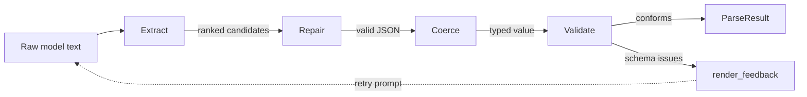

# llm-output-contract

[](https://github.com/manyu-lnmiit/llm-output-contract/actions/workflows/ci.yml)
[](LICENSE)
[](https://www.python.org/downloads/)

**Turn the messy text a language model actually returns into structured data you can trust.** `llm-output-contract` extracts the JSON hiding inside a chatty response, deterministically repairs the near-JSON mistakes models love to make, coerces loose types toward your schema, and validates the result against a JSON Schema contract — then, if it still doesn't fit, hands the model a precise, machine-generated list of what to fix and tries again. No SDK lock-in, no `eval`, no regex-and-pray.

## Install

```bash
pip install llm-output-contract
```

## 30-second quickstart

```python
from outputcontract import parse

schema = {
    "type": "object",
    "properties": {
        "name": {"type": "string"},
        "age": {"type": "integer"},
    },
    "required": ["name", "age"],
}

# This is what a model *actually* sends back — prose, a code fence,
# a trailing comma, an unquoted key, and a stringified integer.
raw = """Sure! Here's the person:
```json
{ name: "Ada Lovelace", "age": "36", }
```"""

result = parse(raw, schema)
print(result.value)      # {'name': 'Ada Lovelace', 'age': 36}
print(result.repairs)    # ['trailing_commas', 'unquoted_keys']
print(result.coercions)  # ["/age: '36' coerced to int"]
```

That's the whole hello-world: give it the raw response and a schema, get back a
clean Python object plus an audit trail of everything that had to be fixed.

---

## The problem

Every team that asks an LLM for structured output hits the same wall. You prompt
"reply with JSON only," and most of the time you get JSON. But the tail is
brutal and unbounded:

- The JSON is wrapped in ```` ```json ```` fences, or buried under "Certainly! Here is…".
- Keys are unquoted, strings use `'single quotes'`, there's a trailing comma, or a stray `// comment`.
- The shape is right but the types are wrong: `"42"` for an integer, `"yes"` for a boolean, `HIGH` for an enum that wanted `high`.
- The model returns a bare object where you asked for a list, or two JSON documents glued together.
- A required field is simply missing.

Provider "JSON mode" and function-calling help, but they don't cover local
models, older endpoints, streamed fragments, or the moment a model decides to be
helpful and add a closing sentence. The usual fix is a growing pile of `try/except`,
regex, and string surgery that every project reinvents. This library is that
pile, done once, tested, and auditable.

## How it works

`parse()` runs a four-stage pipeline. Each stage is pure and records what it
did, so you can log or reject a response based on *how much* had to be fixed.



1. **Extract** — a string- and escape-aware scanner finds every balanced `{...}` / `[...]` region and every fenced block, ignoring braces inside string literals, and ranks the candidates best-first (fenced, object-shaped, longer). Prose is never mistaken for a payload.
2. **Repair** — a single-pass rewriter turns near-JSON into strict JSON: smart quotes, `//` and `/* */` comments, single quotes, unquoted keys, `True/False/None`, `NaN/Infinity`, trailing commas, unterminated strings and brackets, and concatenated documents. Every rule that fires is named. Nothing is ever `eval`-ed.
3. **Coerce** — the value is walked alongside your schema and nudged toward the declared types: `"42"` → `42`, `"yes"` → `True`, `HIGH` → `high`, a scalar wrapped into a one-element array, `$ref`/`anyOf` resolved. Every change is reported as a `/path: description` string.
4. **Validate** — the result is checked against your JSON Schema (draft 2020-12) via `jsonschema`. Failures become tidy `ValidationIssue` objects with a JSON pointer and a message.

If validation fails, `render_feedback()` converts the issues into a compact
instruction block, and `parse_with_retries()` feeds it back to your model.

## Define the contract once

You don't have to hand-write JSON Schema. Point `schema_from()` at a dataclass,
`TypedDict`, or Pydantic model:

```python
import dataclasses
from outputcontract import parse, schema_from

@dataclasses.dataclass
class Ticket:
    title: str
    story_points: int
    blocked: bool

result = parse('{title: "Rate limit", story_points: "5", blocked: "no"}', schema_from(Ticket))
print(result.value)  # {'title': 'Rate limit', 'story_points': 5, 'blocked': False}
```

## Self-healing retry loop

`parse_with_retries` inverts control: you provide a function that calls *your*
model (OpenAI, Anthropic, a local model, anything), and the loop supplies
schema-derived feedback until the output conforms or the attempt budget runs
out. No provider SDK is imported by this library.

```python
from outputcontract import parse_with_retries, RetryBudgetExceeded

def call_model(feedback: str | None) -> str:
    messages = [{"role": "user", "content": "Extract the person as JSON."}]
    if feedback:                       # None on the first attempt
        messages.append({"role": "user", "content": feedback})
    return my_llm_client.complete(messages)   # returns raw text

try:
    result = parse_with_retries(call_model, schema, max_attempts=3)
except RetryBudgetExceeded as exc:
    print(f"gave up after {exc.attempts} attempts:", exc.last_error)
```

A generated feedback message looks like:

```
Your previous JSON did not match the required schema. Fix these problems:
- at /age: 42 is not of type 'string'
- at (root): 'name' is a required property
Return only the corrected JSON, with no prose or code fences.
```

## Run the example

```bash
git clone https://github.com/manyu-lnmiit/llm-output-contract
cd llm-output-contract
pip install -e ".[dev]"
python examples/basic_usage.py
pytest
```

Or with Docker:

```bash
docker build -t llm-output-contract .
docker run --rm llm-output-contract
```

## Limitations

- **Repair is heuristic, not a full JSON5/HJSON parser.** It targets the mistakes LLMs actually make; a payload mangled in a novel way may still fail — by design, `parse` raises rather than guessing wildly.
- **Coercion is intentionally conservative.** It won't invent missing required fields or reformat free-form dates; those surface as validation issues for the retry loop to handle.
- **Semantic correctness is out of scope.** The library guarantees *shape and type*, not that the model's answer is *true*. A schema-valid hallucination is still a hallucination.
- **JSON Schema is the contract language.** `schema_from` covers common Python types but is not a complete type-to-schema compiler; complex generics may need a hand-written schema.
- **`jsonschema` is required** for full draft-2020-12 validation; a minimal structural fallback runs if it is somehow unavailable, but the real dependency is the supported path.

## License

MIT © Abhimanyu — see [LICENSE](LICENSE).
